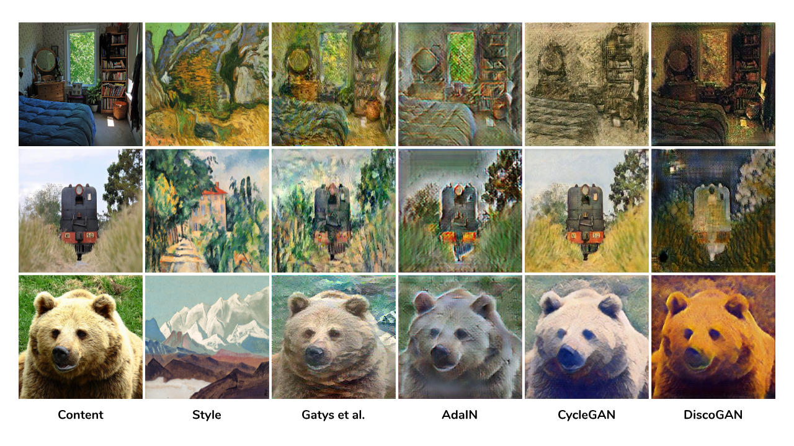
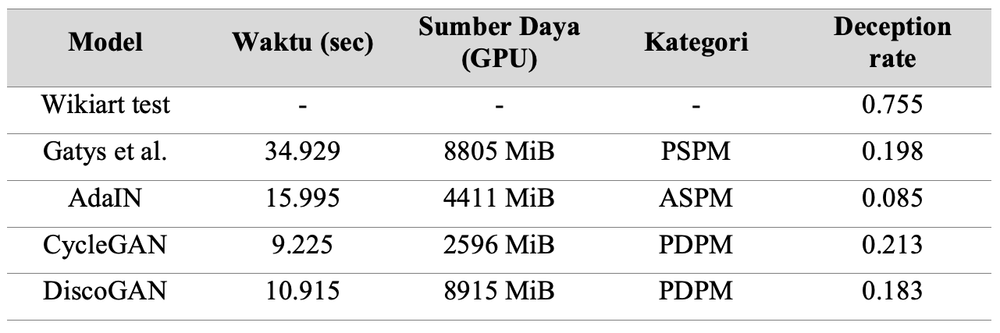

# PaintGAN Framework [](https://colab.research.google.com/drive/1JkWbnn-L_MflojHc3YVaPjQHabupmha_?usp=sharing)
> Comparison of Style Transfer Models in Painting Domains

PaintGAN is a framework that puts together Style Transfer models specifically in Painting Domains
to be implemented in Tensorflow 2.8+ in a Google Colab environment.



## Metrics



This research was done using the following arbitrary images (only for models capable of arbitrary style transfer)

```python
{
    'claude-monet': 'paintgan-dataset/wikiart/Impressionism/claude-monet_the-seine-near-giverny-1.jpg',
    'nicholas-roerich': 'paintgan-dataset/wikiart/Symbolism/nicholas-roerich_himalayas-chain-of-kanchenjunga-1936.jpg',
    'pablo-picasso': 'paintgan-dataset/wikiart/Cubism/pablo-picasso_flowers-on-the-table-1907.jpg',
    'paul-cezanne': 'paintgan-dataset/wikiart/Post_Impressionism/paul-cezanne_house-with-red-roof-1890.jpg',
    'salvador-dali': 'paintgan-dataset/wikiart/Expressionism/salvador-dali_two-adolescents.jpg',
    'vincent-van-gogh': 'paintgan-dataset/wikiart/Post_Impressionism/vincent-van-gogh_the-gully-peiroulets-1889.jpg',
}
```

## Usage

If you choose to implement it yourself, please read this usage guide.

### Requirements

* Python 3.8+
* Tensorflow 2.8+
* GPU 12GB+
* Storage Size 200GB+

You can find this exact specification using [Google Colab Pro+](https://colab.research.google.com/signup)

### Downloading Dataset

Before we download the dataset, it is necessary that you have a Kaggle account to be able to access some of the dataset in this research.

```bash
export KAGGLE_USERNAME="KAGGLE_USERNAME";
export KAGGLE_KEY="KAGGLE_KEY";
```

Using the download script below you can download datasets used in this research.

```bash
python -m scripts.download --source=DRIVE --data-dir=. --dataset="80K";
python -m scripts.download --source=DRIVE --data-dir=. --dataset=EVAL;
python -m scripts.download --source=DRIVE --data-dir=paintgan-dataset/eval_set.hdf5 --dataset=EVAL_SET;
python -m scripts.download --source=DRIVE --data-dir=paintgan-dataset/eval_model.h5 --dataset=EVAL_MODEL;
```

(Optional) If you want to experiment on cartoon domains, you can use the following script
```bash
export K_DATA_DIR="./cartoon-dataset";
export K_DATASET="volkandl/cartoon-classification";

python -m scripts.download --source=KAGGLE --data-dir=$K_DATA_DIR --dataset=$K_DATASET;
```

### Training

To train the model, you can refer to the help documentation.

```bash
python -m scripts.train --help

usage: train.py [-h] --model MODEL --content CONTENT --style STYLE [--epochs EPOCHS] [--steps-per-epoch STEPS_PER_EPOCH] [--batch-size BATCH_SIZE] [--buffer-size BUFFER_SIZE] [--learning-rate LEARNING_RATE] [--content-domain CONTENT_DOMAIN]
                [--style-domain STYLE_DOMAIN] [--max-set MAX_SET]
```

### Inference

To test the model using checkpoints. (the model for inference is costly to save in Google Drive, please contact author or make new ones)

```bash
python -m scripts.test -h

usage: test.py [-h] --model MODEL --content CONTENT [--style STYLE] [--checkpoint CHECKPOINT] [--save-file SAVE_FILE]
```

### Evaluate (Inference to a Repository)

Same as how we infer the model, this only loops over a folder of images to stylize.

```bash
python -m scripts.evaluate -h

usage: evaluate.py [-h] --model MODEL --content-dir CONTENT_DIR [--style STYLE] [--checkpoint CHECKPOINT] [--save-file SAVE_FILE]
```

To score the evaluation set, we use the script below based on the metric used.

```bash
python -m scripts.score -h   

usage: score.py [-h] --metric METRIC --model MODEL [--eval-dir EVAL_DIR] [--eval-dataset EVAL_DATASET] [--checkpoint CHECKPOINT]
```

## Documentation

### Models

Found in the `paintgan/algorithm` folder.

Style Transfer models are implemented using Tensorflow 2.8+ with each of them having a subfolder  `paintgan/algorithm/{model}_comp/` to store classes and functions
for implementation. Here are a few models implemented within this framework.

* Gatys et al. -- _A Neural Algorithm of Artistic Style, 2016_ [📝](https://arxiv.org/abs/1508.06576)
* AdaIN -- _Arbitrary Style Transfer in Real-time with Adaptive Instance Normalization, 2017_ [📝](https://arxiv.org/abs/1703.06868)
* CycleGAN -- _Unpaired Image-to-Image Translation using Cycle-Consistent Adversarial Network, 2017_ [📝](https://arxiv.org/abs/1703.10593?amp=1)
* DiscoGAN -- _Learning to Discover Cross-Domain Relations with Generative Adversarial Network, 2017_ [📝](https://arxiv.org/abs/1703.05192)

Feel free to fork this repo and experiment with your own model to add domain comparison.

### Data Loader

Found in the `paintgan/util/data_loader.py` folder.

Stated by "DRB-GAN: A Dynamic ResBlock Generative Adversarial Network for Artistic Style Transfer" [📝](https://arxiv.org/abs/2108.07379?context=cs) categorized style transfer models into five different approaches.

* Per-Style-Per-Model (PSPM) -- Only takes pairs of content and style images
* Multiple-Style-Per-Model (MSPM) -- Takes a collection of content image(s) and/or style image(s)
* Arbitrary-Style-Per-Model (ASPM) -- Takes an arbitrary collection of content images and style images within a domain
* Per-Domain-Per-Model (PDPM) -- Takes a certain collection of a domain, collections are content images and style images (specific to painters usually)
* Multiple-Domain-Per-Model (MDPM) -- Takes multple collections within a domain, collections are content images and style images (may reach arbitrary style transfer)

Authors needed to create different data loading techniques for different categories of style transfer models.

### Evaluation

Found in the `paintgan/evaluate` folder.

Evaluation methods are easily implementable within the framework. Mainly focusing on evaluation methods used by SOTA or
specifically designed for Painting Domains. Here are a few evaluation method implemented.

* Speed and Memory -- Score a model based on its performance on individual style transfer task in time and memory usage.
* Deception Rate -- Score a given set of styled images in respect to their painter using a VGG-16 classifier [📝](https://compvis.github.io/adaptive-style-transfer/).

## Author

* Abhishta Gatya ([Email](mailto:abhishtagatya@yahoo.com)) -- Software Engineer / ML Engineer

## Reference

TBA